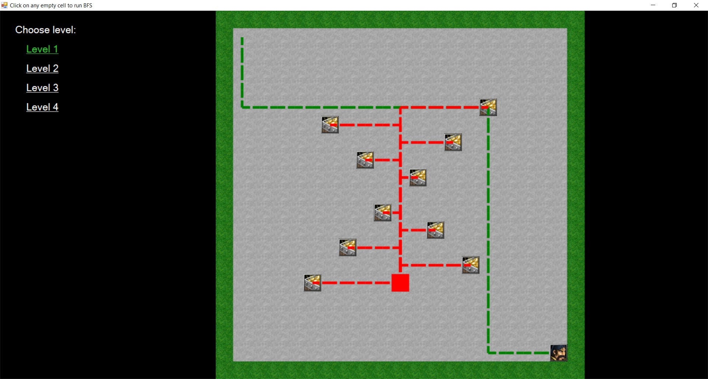
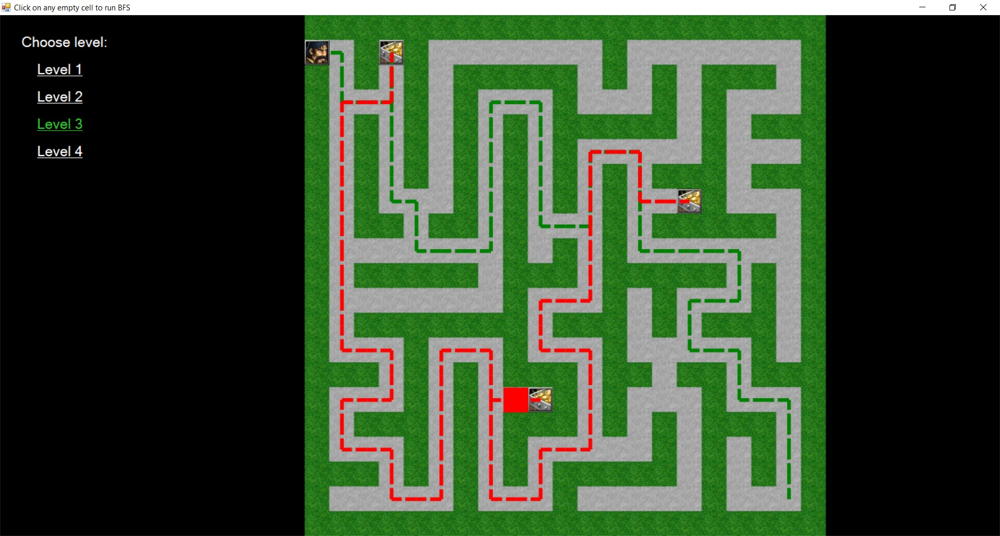
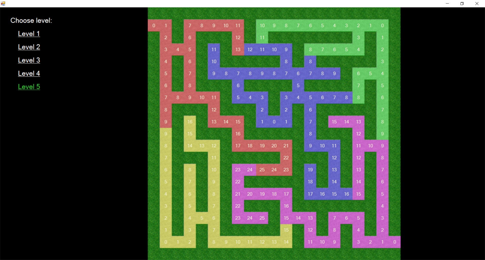

# Практики «Поиск в ширину», «Вынести клад!» и «Поделить территорию!»
Репозиторий содержит решения [этой](https://ulearn.me/course/basicprogramming2/Praktika_Poisk_v_shirinu__caa8cdce-f319-4147-810a-451f1c3c8e48), [этой](https://ulearn.me/course/basicprogramming2/Praktika_Vynesti_klad__09c5a77f-40a2-4821-9ef0-aa65b49e92e7) и [этой](https://ulearn.me/course/basicprogramming2/Praktika_Podelit_territoriyu__c5ca2435-13ea-4b96-ac51-c673f06c4c34) задачи с ulearn.me.
Задачи прошли код-ревью у преподавателя (баллы: 50/50, 100/100, 50/50). Все решения курса на максимальный балл также выложены в других репозиториях.
Ветка unsolved содержит изначальный проект.

Конечное приложение - прототип пошаговой 2D игры, в которой герою нужно собирать сокровища и найти выход.

## Практика «Поиск в ширину»
На карте расположено несколько сундуков. Для тех сундуков, до которых существует путь от точки start, необходимо найти путь от сундука до точки start в виде односвязного списка  `SinglyLinkedList`.

Для этого в классе  `BfsTask`  нужно реализовать поиск в ширину с указанной сигнатурой. Кстати, он вам понадобится и для следующей задачи!

Проверить корректность своего решения можно запустив тесты в классе  `Bfs_Should`. Там же, по тестам, можно уточнить постановку задачи на различных крайних случаях.

После корректного выполнения задания, можно будет запустить проект. Кликнув на пустую ячейку вы увидите найденный вашим алгоритмом путь.

## Практика «Вынести клад!»
Подготовка закончилась и вы в настоящем лабиринте с сокровищами! Сил хватит только на один сундук и то еле-еле. Найдите кратчайший путь из начальной точки до выхода, проходящий через хотя бы один сундук.

Решайте задачу в классе  `DungeonTask`.

Детали реализации для граничных случаев можно найти в классе с тестами  `Dungeon_Should`. Сделайте так, чтобы все тесты проходили.

После выполнения этого задания, при запуске проекта можно увидеть визуализацию пути. Наслаждайтесь найденными сокровищами!

Эту задачу можно элегантно решить без циклов, используя LINQ.
## Практика «Поделить территорию!»
Оказалось, что в лабиринте есть и другие охотники за сокровищами. Естественно, кто первый доберется до сундука, тот его и заберет себе.

Неплохо бы знать, кто из соперников до каких клеток лабиринта успеет добраться быстрее других.

В классе RivalsTask реализуйте функцию разделяющую карту между игроками.

Нужно определить, до каких из клеток карты каждый игрок сможет дойти быстрее, вне зависимости от тактики остальных. Ходят игроки по очереди, начиная с первого.

Сделайте так, чтобы все тесты в классе Rivals_Should проходили.

После выполнения этого задания, при запуске проекта можно увидеть визуализацию процесса раздела карты.
